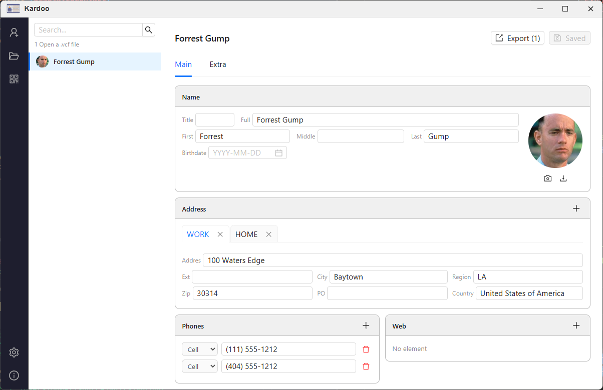

# Kardoo

> A simple and clean desktop tool to view, edit and manage your VCF (vCard) contact files.



---

## Features

- 📂 Open single or multi-contact `.vcf` files
- ✏️ Edit all standard vCard fields (v2.1, v3.0, v4.0)
  - Name, photo, birthday, anniversary
  - Phone numbers, emails, addresses, URLs
  - Organization, title, role, nickname
  - Languages, messaging (IMPP), related persons
  - Notes, geo, timezone, gender, categories
  - Sound (pronunciation) — playback or download
- 💾 Save changes back to the original `.vcf` file
- 🔍 Search contacts by name or organization
- 🖼️ Change contact photo from a local image file
- ⚠️ Unsaved changes protection on contact switch or file open

---

## Screenshots


---

## Tech Stack

| Layer         | Technology                   |
| ------------- | ---------------------------- |
| Framework     | [Wails v2](https://wails.io) |
| Frontend      | React + Vite                 |
| UI Library    | Ant Design                   |
| Backend       | Go                           |
| vCard Parsing | vcard-parser                 |

---

## Getting Started

### Prerequisites

- [Go 1.21+](https://go.dev/dl/)
- [Node.js 18+](https://nodejs.org/)
- [Wails CLI](https://wails.io/docs/gettingstarted/installation)

```bash
go install github.com/wailsapp/wails/v2/cmd/wails@latest
```

### Install & Run

```bash
git clone https://github.com/your-username/kardoo.git
cd kardoo
wails dev
```

### Build

```bash
wails build
```

The compiled binary will be in `build/bin/`.

---

## License

MIT © 2025 abdelkader
